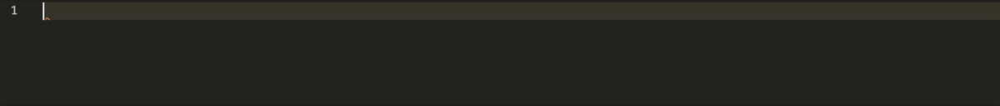

**TL;DR:** Yes it’s possible to use it everywhere ! Typescript is the addition of typing to Javascript. So it can be used wherever Javascript is, with the same flexibility but adapted for large projects. Its slogan:

*Typescript ”JavaScript that scales.”*

This article introduces TypeScript, its pros and cons and describe how to configure it in existing JavaScript project.


# Introduction
TypeScript was invented 10 years ago by Anders Hejlsberg. He was already the architect of **Turbo Pascal, Delphi then DotNet / C # at Microsoft.**

Its purpose is to complete JavaScript by **improving its robustness** while keeping an almost **identical syntax, flexibility and compatibility** with existing JavaScript projects.

To do this, it adds, among other things, the classic functionalities of object-oriented languages (typing, class, inheritance, abstraction, method overriding, member visibility), which makes it more suitable for **large projects**, while allowing several programming styles (functional , object-oriented, etc.).

Finally, thanks to its **transpiler** (program which will convert its code into JavaScript), that TypeScript can be used in any project requiring JavaScript (front, back, mobile).

# Typing
Among all TypeScript features, only *typing* is required. Typing is specifying inside the code the form of the data of each:
* variables : `let myName: string`
* function arguments and return: `function sayHi (name: string): string {return "Hi" + name}`

There are [13 types](https://www.typescriptlang.org/docs/handbook/basic-types.html) provided by TypeScript. The most used are: `string, number, boolean, array, tuple, enum, any` and `void`, where `any` is a wildcard that can replace any other type. void is used when the function returns nothing. The other types are rarely use: `unknown, null, undefined, never` and `object`.

These 13 types are called "basics" types. They can be used to build custom types: type or [interface](https://www.typescriptlang.org/docs/handbook/2/everyday-types.html#interfaces) (the main difference between type and interface is that the interface can extend another interface):

```Typescript
type Human = {
  name: string;
  age: number;
};
```

Then it is used like this:
```Typescript
const myPerson: Human = {name: 'George', age: 30};
```

which is equivalent to:
```Typescript
const myPerson: {name: string; age: number;} = {name: 'George', age: 30};
```

But it is recommended to write the types/interfaces in external file for better reusability. This file is called a [declaration](https://www.typescriptlang.org/docs/handbook/declaration-files/introduction.html) file whose extension is “.d.ts”.

## Union
Sometimes the person can be an alien. TypeScript can be told that the type can be `Human` or an `Alien` with the operator “|”. This is called an union type:
```Typescript
const myLivingEntity: Person | Alien = {name: 'George', age: 30};
```
where `Alien` will be a totally different type from the `Person` type.

## Optional
Sometimes, we do not know the name of the person. So the property name of a custom type can be [optional](https://www.typescriptlang.org/docs/handbook/interfaces.html#optional-properties) (with “?” operator):
```Typescript
type Person = {
  name?: string;
  age: number;
};
```
Then we can omit to set the name property:
```Typescript
const myPerson: Person = {age: 30};
```

## Inference
It is not necessary to specify all types, Typescript can **infer** them most of the time. It’s called Type inference. In this example :
```Typescript
const age = 34; // instead of const age: number = 34;
```
TypeScript can **guess** `age` has the type `number` without setting explicitly.

## Compilation
TypeScript comes with its compiler, that will convert its code into JavaScript one.

1. Install TypeScript with this command: `yarn add typescript --dev`
2. Compile with this command: `yarn tsc test.ts`


Inline-style: 



